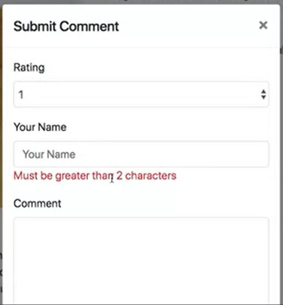
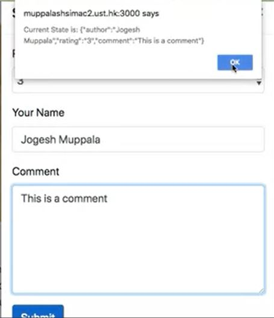

Preview of README.md
Create a single page to display a product of your choice along with an option to submit a feedback comment. Upon clicking the comment button , you should display a popup model with the following options:

Rating : 1 to 5. (Drop down)

Your name (Text field) -

comment (Text area)

Submit button.

Validation: If you try to submit the form with less than 2 char or more than 15 char in Your name, you should get an error as shown in the image below:

If the form submition is successful , display the output as shown in the below figure.

note : you have to use react-hook-form npm package to complete this assignment , you have to explore by yourself about this package and complete this assignment

